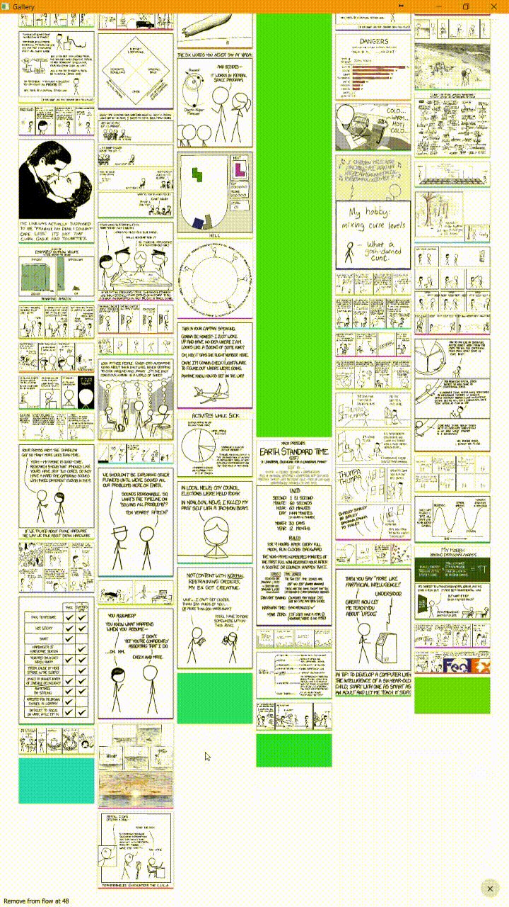

Simple QML Gallery(Test)
====

**Just an implementation of full screen image viewer with zoom-from-click(inspired from Android?) effect** and it becomes an experimental web gallery.




try it:
```
sh -c "$(curl -fsSL http://​kotori.us/qml/gallery.sh)"
```

TODO: ~~...~~
